# 🚘 CityMotion — Gestão Inteligente de Frotas

**Sistema SaaS de gestão de frotas veiculares para prefeituras, logística e mobilidade corporativa.**

<p align="center">
  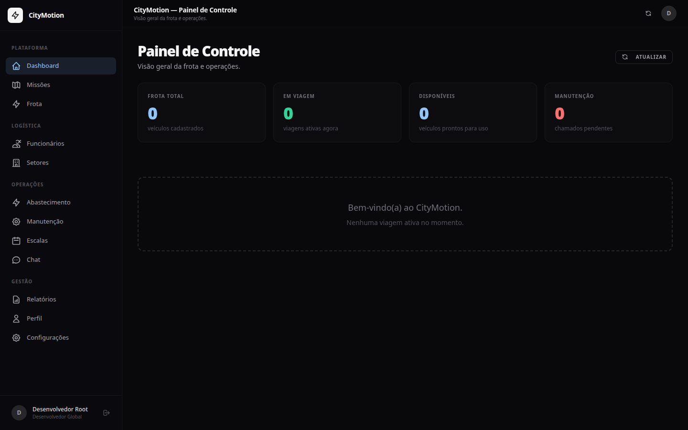
</p>

---

## 📸 Visão Geral do Sistema

| Tela | Preview |
| :--- | :--- |
| **🔐 Login** |  |
| **📊 Dashboard** — KPIs, gráficos e alertas da frota |  |
| **🗺️ Viagens** — Agendamento, check-in/check-out, incidentes | 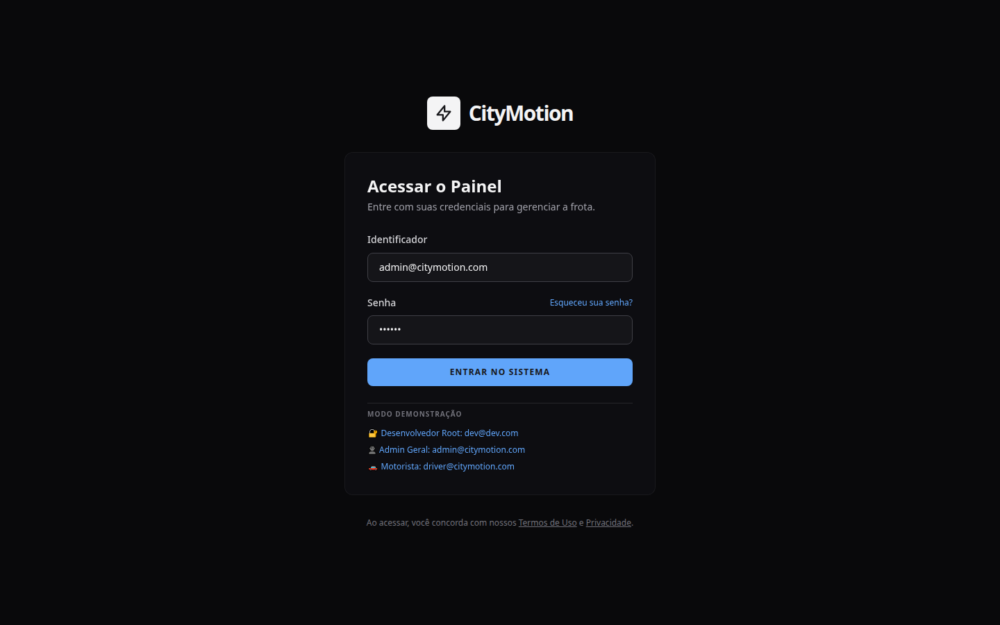 |
| **🚗 Veículos** — Cadastro, status, telemetria | 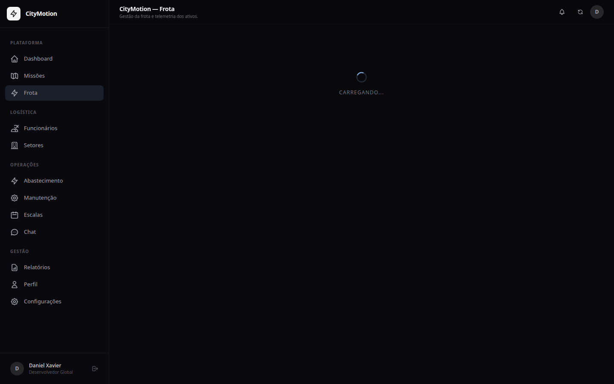 |
| **👥 Funcionários** — Gestão de pessoas, cargos, permissões | 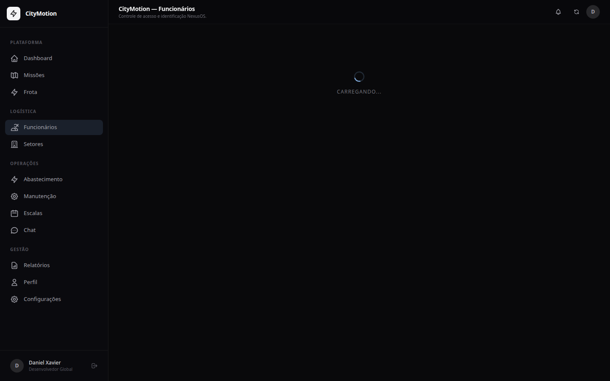 |
| **🏢 Setores** — Estrutura organizacional | 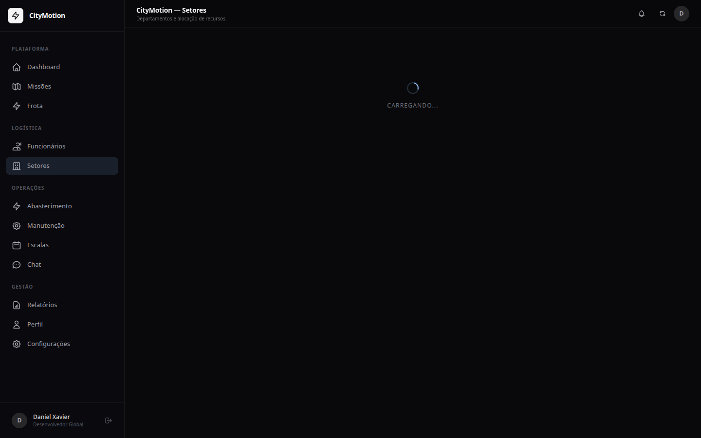 |
| **⛽ Abastecimento** — Controle de consumo | 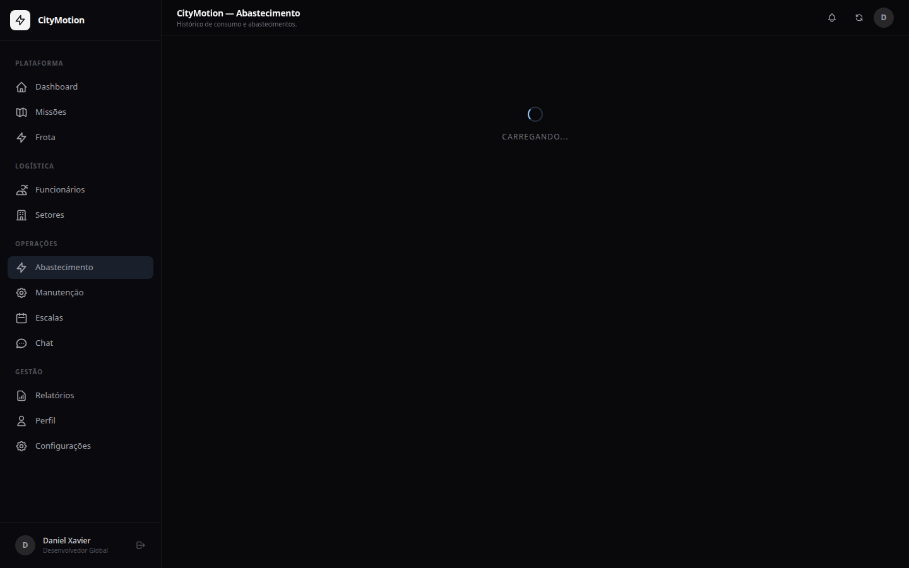 |
| **🔧 Manutenção** — Kanban visual de OS | 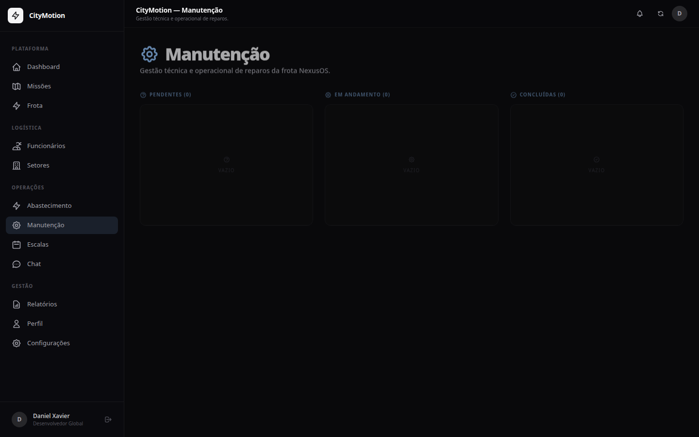 |
| **📅 Escalas** — Agenda de trabalho | 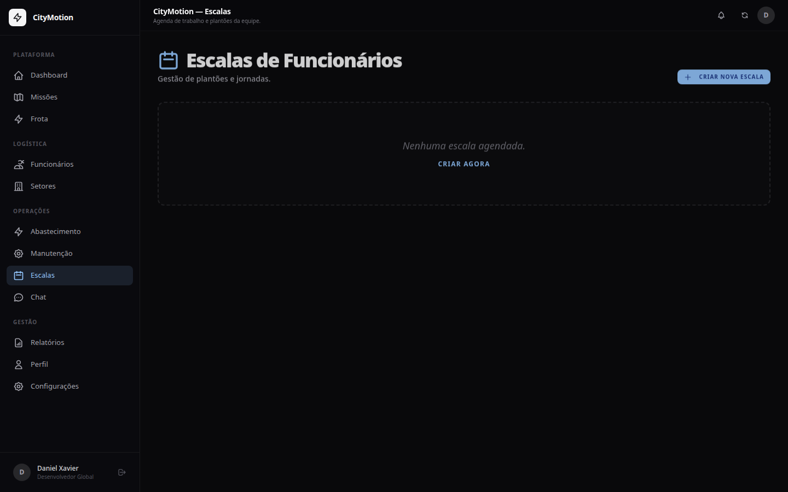 |
| **💬 Chat** — Comunicação interna | 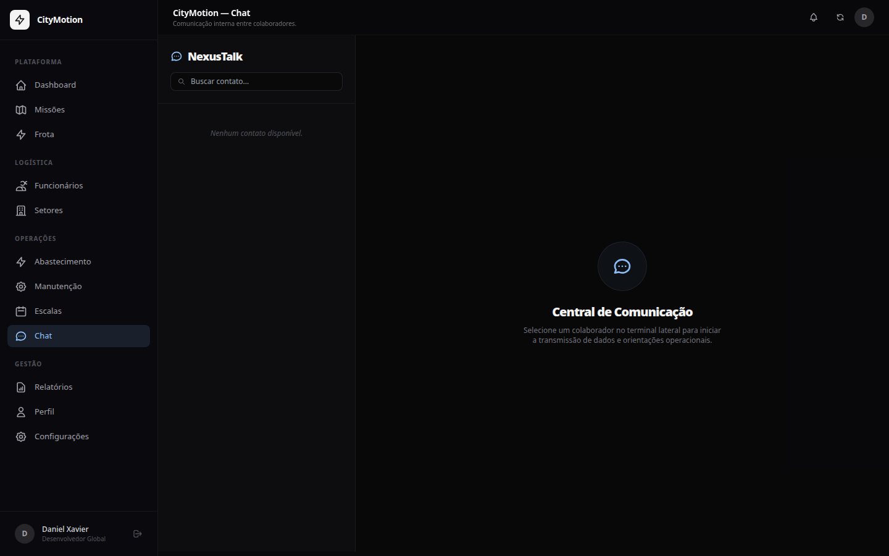 |
| **📈 Relatórios** — Estatísticas e gráficos | 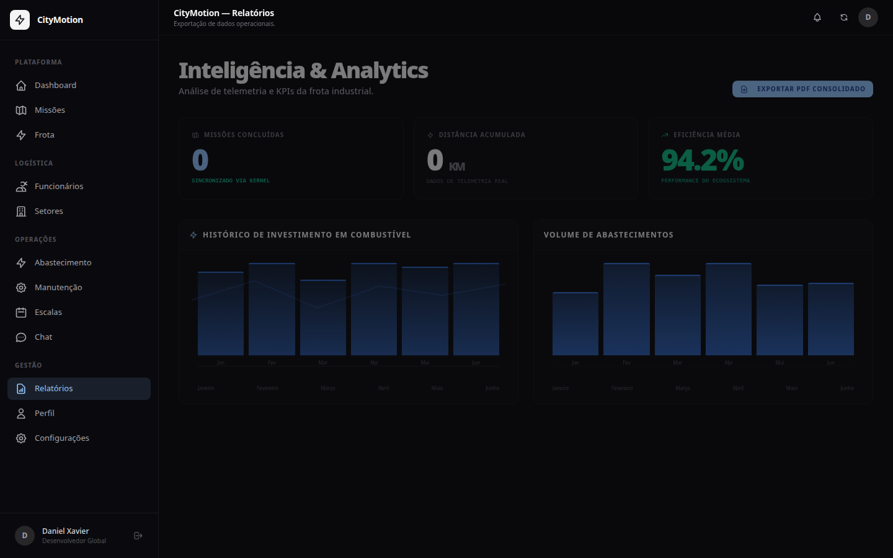 |
| **👤 Perfil** — Informações do usuário | 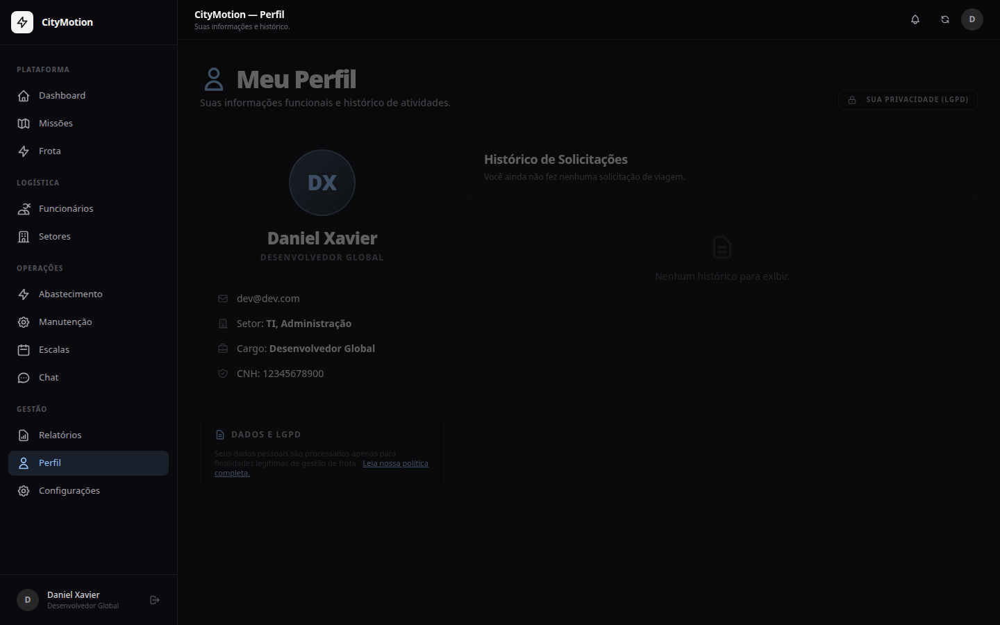 |
| **⚙️ Configurações** — Operações + Infraestrutura | 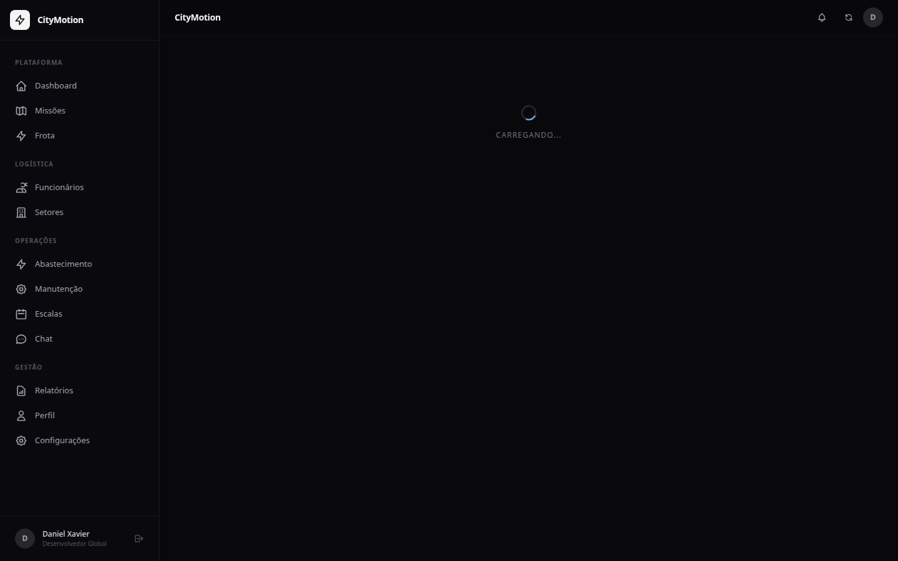 |

---

## ✨ Funcionalidades

| Módulo | Descrição | Perfis |
| :--- | :--- | :--- |
| **📊 Dashboard** | KPIs da frota, gráficos de atividade, alertas | Todos |
| **🚗 Veículos** | Cadastro, status (Disponível/Em Viagem/Manutenção), histórico | Admin, Gestor, Motorista |
| **👥 Funcionários** | Cadastro com matrícula, cargo, setor, soft delete, LGPD | Admin, Gestor |
| **🗺️ Viagens** | Ciclo completo: solicitação → check-in → check-out → auditoria | Todos |
| **⛽ Abastecimento** | Controle de consumo (km/l), valor total, histórico | Admin, Gestor, Motorista |
| **🔧 Manutenção** | Kanban 3 colunas, solicitação de peças, prioridades | Admin, Gestor, Mecânico |
| **📅 Escalas** | Agenda de trabalho diária/semanal/mensal/plantão | Admin, Gestor |
| **🏢 Setores** | Estrutura organizacional e alocação | Admin |
| **💬 Chat** | Mensagens internas com filtro por setor | Todos |
| **📈 Relatórios** | Estatísticas, gráficos de telemetria, exportação PDF | Admin, Gestor |
| **📄 Meus Relatórios** | Histórico pessoal de viagens + exportação PDF para motoristas | Motorista |
| **💬 Chat** | Mensagens internas em tempo real via WebSocket com indicador de digitação | Todos |
| **⚙️ Configurações** | Operações (regras) + Infraestrutura (DB, CORS, SMTP) | Dev/Admin |
| **🖥️ Terminal Dev** | Console TTY para diagnóstico | Dev |
| **📱 PWA** | Instalável como app, service worker com cache offline, banner de instalação | Todos |

---

## 🏗️ Arquitetura Técnica

```
[Navegador] ← HTTP + WebSocket → [Fastify :3001]
                                    ├── API REST (/api/*)
                                    ├── Socket.IO (tempo real, digitação)
                                    ├── SPA Frontend (servido em /)
                                    ├── PWA Service Worker (cache + offline)
                                    └── Swagger (/docs)
                                           │
                              [SQLite (dev) / PostgreSQL (prod)]
                                           │
                              Drizzle ORM (multi-engine)
                                           │
                              [Supabase Auth — opcional]
```

### Stack

| Camada | Tecnologia |
| :--- | :--- |
| **Frontend** | SPA HTML/JS/CSS + Tailwind + Chart.js + Lucide Icons |
| **Frontend** | SPA HTML/JS/CSS modular (refatorado em módulos) + Tailwind + Lucide Icons |
| **Backend** | Fastify + JavaScript (ESM) + Drizzle ORM |
| **Autenticação** | JWT (jsonwebtoken) + Supabase Auth (dual mode) + Bcrypt |
| **Segurança** | Rate Limiting + CORS + Zod Validation + RBAC (6 níveis) + RLS |
| **Tempo Real** | Socket.IO (WebSockets + notificações + indicador digitação) |
| **Banco Padrão** | SQLite3 (better-sqlite3) — portátil, offline |
| **Banco Nuvem** | PostgreSQL — produção escalável |
| **Container** | Docker multi-estágio + Docker Compose |
| **Hospedagem** | Render Blueprint + deploy automático via GitHub |
| **Banco Nuvem** | PostgreSQL gerenciado pelo Render (free tier) |
| **Qualidade** | 189+ testes (Vitest + jsdom) |
| **PWA** | Service Worker com cache, instalável, offline page |

---

## 🚀 Como Executar

### Local (Desenvolvimento)

```bash
cp .env.example .env
# Preencha JWT_SECRET (gere com: node -e "console.log(require('crypto').randomBytes(64).toString('hex'))")

cd backend && npm install
npx tsx src/index.ts
# → http://localhost:3001
```

### Docker

```bash
docker compose up citymotion
# → http://localhost:3001
```

### Render (Produção)

```bash
# 1. Push para o GitHub
# 2. Render Dashboard → New + → Blueprint
# 3. Selecione o repositório
# 4. Configure CORS_ORIGIN após o deploy
```

---

## 🔐 Credenciais de Teste

| Perfil | E-mail | Senha |
| :--- | :--- | :--- |
| 👑 Desenvolvedor Root | `dev@dev.com` | `123456789` |
| 👤 Administrador | `admin@citymotion.com` | `123456` |
| 🚗 Motorista | `driver@citymotion.com` | `123456` |
| 🧪 Demonstração | `demo@citymotion.com` | `nexus2024` |

---

## 🧪 Testes

```bash
# Testes do frontend SPA (189 testes)
npm run test:frontend

# Testes do backend
cd backend && npm test
```

---

## 📚 Documentação

- [📊 Diagramas de Arquitetura](./docs/DIAGRAMS.md)
- [🏗️ Guia do Backend](./docs/BACKEND_GUIDE.md)
- [🎨 Design System NexusOS](./docs/UI_LAYOUT_GUIDE.md)
- [🛠️ Ferramentas de Administração](./docs/ADMIN_TOOLS.md)
- [📋 Blueprint do Sistema](./docs/blueprint.md)
- [📝 Proposta Comercial](./PROPOSAL.md)
- [📊 Apresentação para Clientes](./docs/business/02-apresentacao-cliente.md)
- [📋 Plano de Negócios](./docs/business/03-plano-de-negocios.md)

---

## 🗺️ Roadmap

### ✅ Fase 1 — Fundação
Motor dual SQLite/PostgreSQL, segurança JWT/Bcrypt/Rate Limiting/CORS, 12 módulos, dashboard adaptativo, painel de configurações, terminal dev.

### ✅ Fase 2 — Conectividade
WebSockets (Socket.IO), notificações em tempo real, chat interno com digitação, toast notifications (42 alert() substituídos), 189+ testes.

### ✅ Fase 3 — Refatoração & PWA
Todas as 12 páginas refatoradas em módulos (index.js + modals.js), Service Worker com cache offline, instalável como PWA, helpers centralizados (format-utils, color-utils, dom-utils), otimizações backend (Promise.allSettled, utils/role.js, utils/employee.js).

### ✅ Fase 4 — Deploy & Infraestrutura
drizzle-kit push automático no build do Render, Supabase Auth opcional (dual mode), render.yaml como Infrastructure as Code, Docker multi-estágio.

### 🔜 Fase 5 — Inteligência
IA preditiva para manutenção, BI avançado, Google Maps, app mobile nativo.

---

**CityMotion — Mobilidade, transparência e eficiência para a gestão moderna.**
