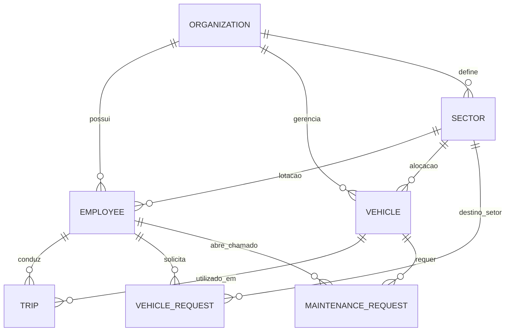
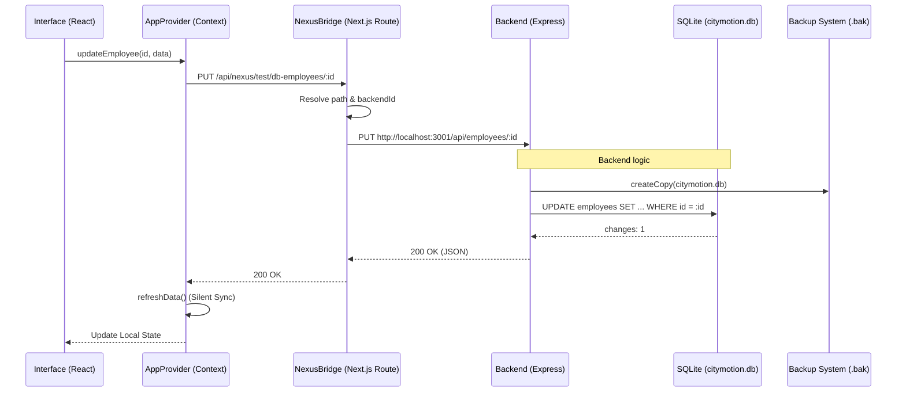
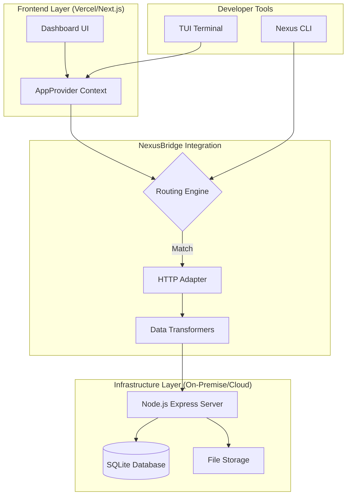
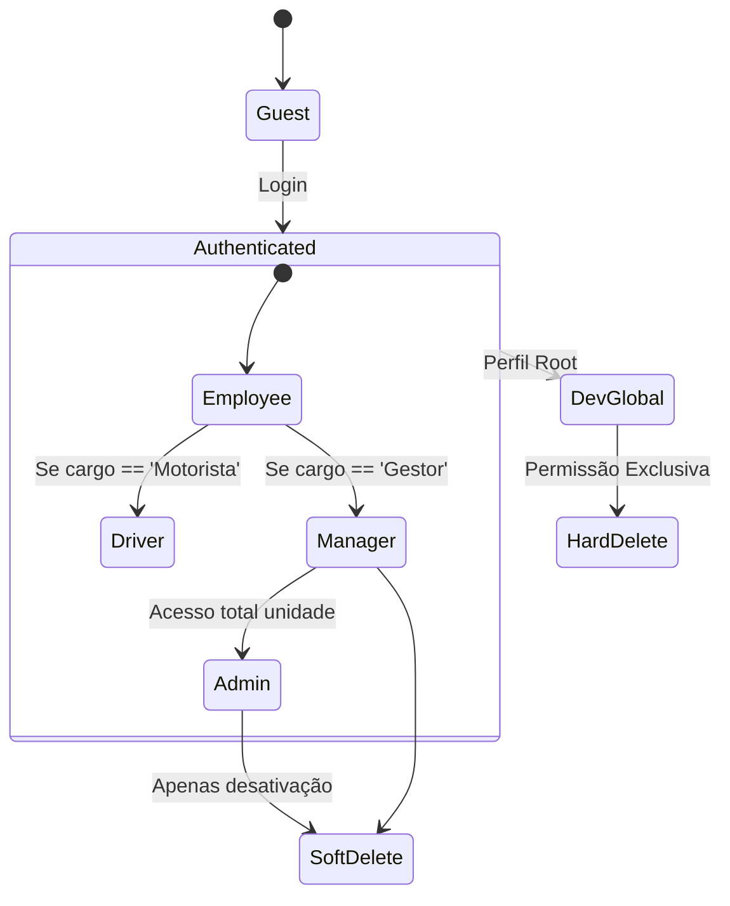

# 📊 Diagramas de Arquitetura e UML - CityMotion

Este documento detalha a estrutura técnica do sistema CityMotion utilizando UML (via Mermaid.js).

---

## 1. Diagrama de Entidade-Relacionamento (ERD)
Este diagrama representa a estrutura lógica do banco de dados SQLite e as relações entre as entidades do sistema.

---

## 2. Diagrama de Sequência (NexusBridge Flow)
Representa o ciclo de vida de uma requisição de atualização de dados, passando pela camada de adaptação.

---

## 3. Diagrama de Componentes (SaaS Layer)
Visão de alto nível da separação de responsabilidades.

---

## 4. Hierarquia de Permissões (State Chart)
Estados possíveis de um usuário dentro do ecossistema.

