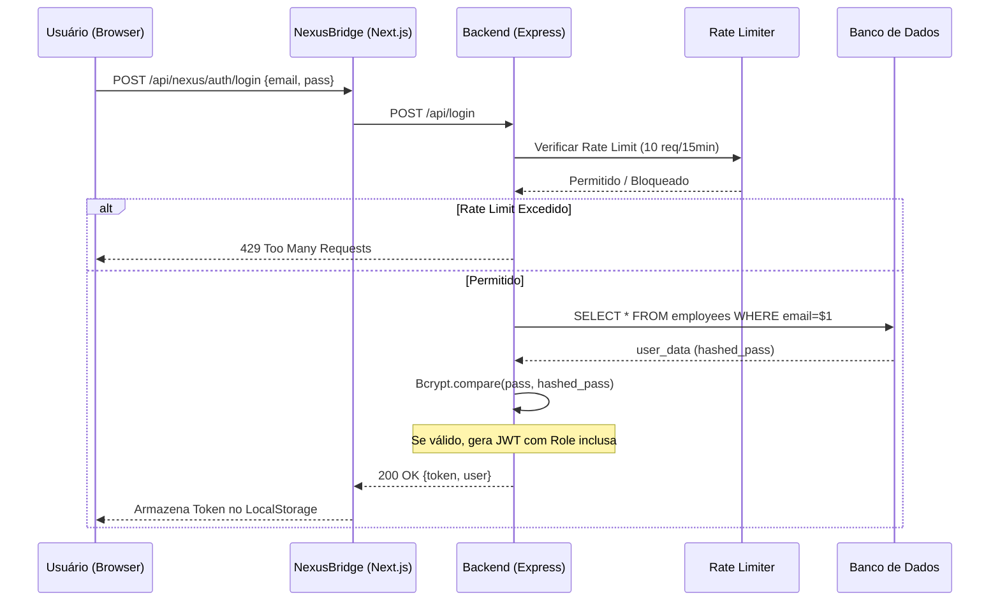
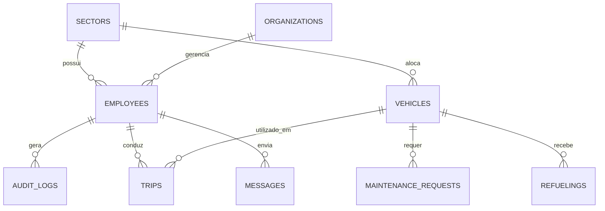
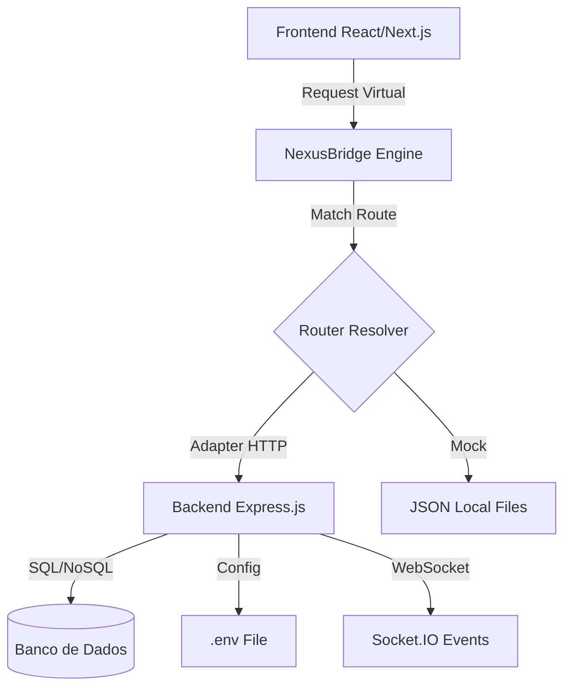
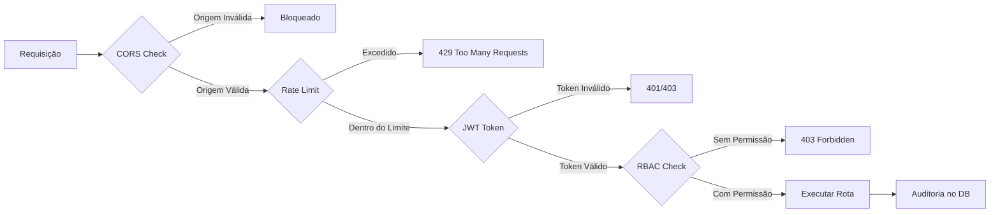
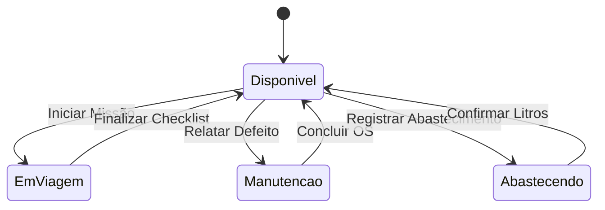
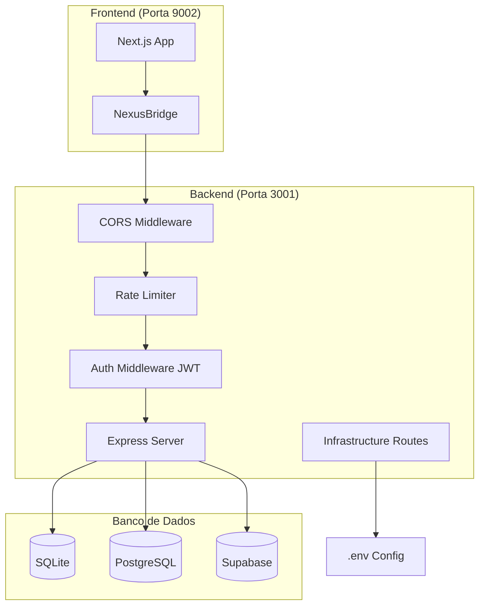
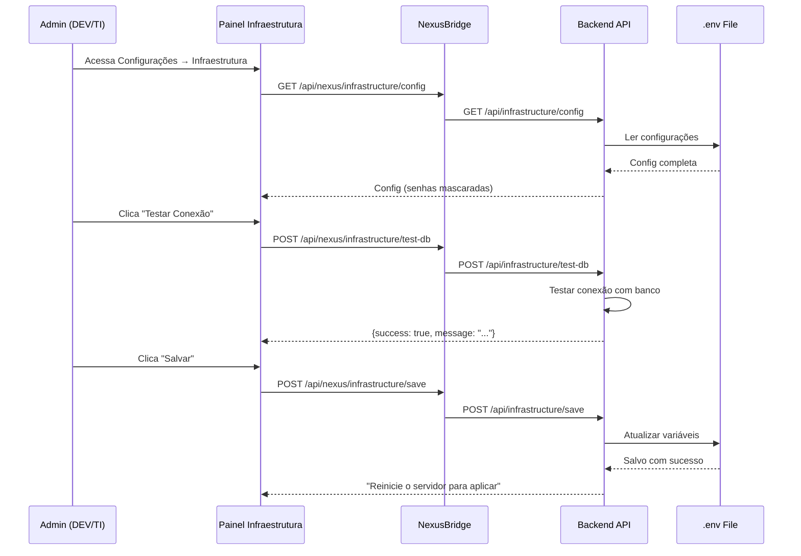

# 📊 Diagramas de Arquitetura e Fluxo - CityMotion

Este documento detalha a estrutura técnica do sistema utilizando UML (Mermaid.js).

---

## 1. Fluxo de Autenticação e Autorização (JWT)
Representa como o sistema valida a identidade sem confiar cegamente no frontend.

---

## 2. Diagrama de Entidade-Relacionamento (ERD)
Estrutura lógica das tabelas no banco de dados.

---

## 3. Arquitetura NexusBridge
Visão de componentes da camada de adaptação.

---

## 4. Fluxo de Segurança Completo

---

## 5. Estados do Veículo (Telemetria)
Ciclo de vida de um ativo na frota.

---

## 6. Arquitetura de Segurança

---

## 7. Fluxo de Configuração de Infraestrutura

