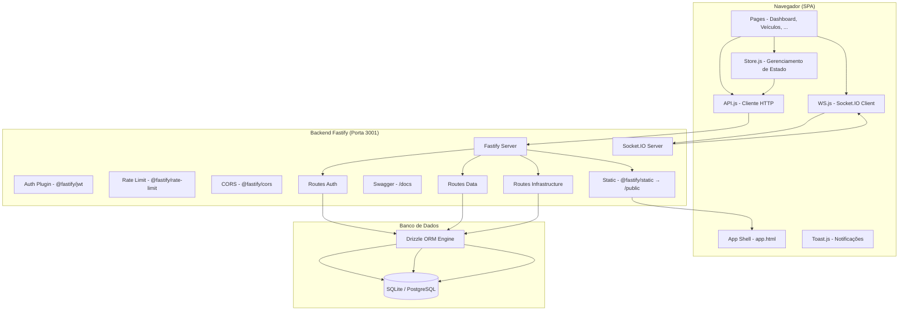
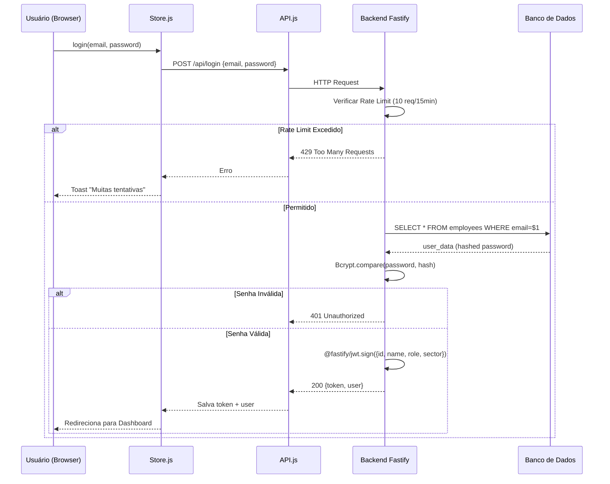
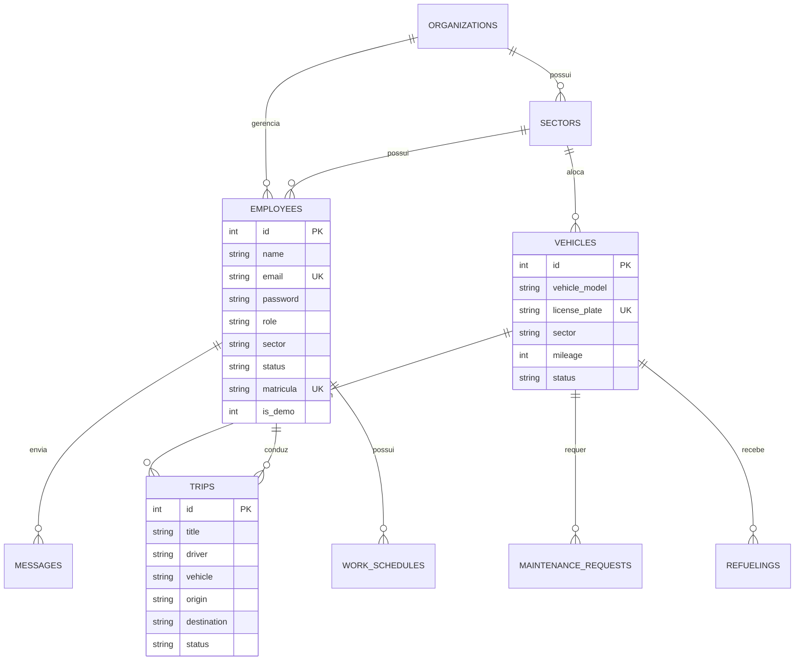
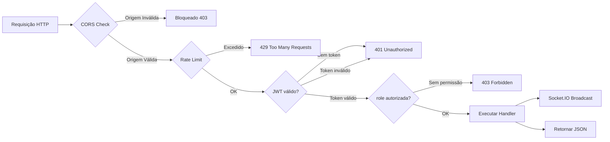
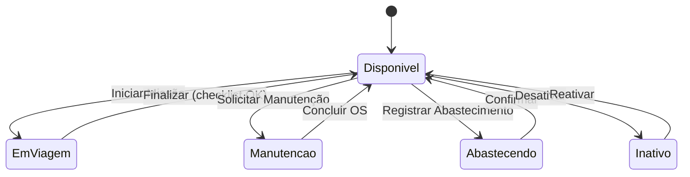
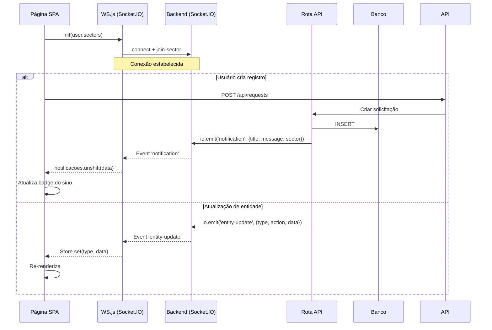
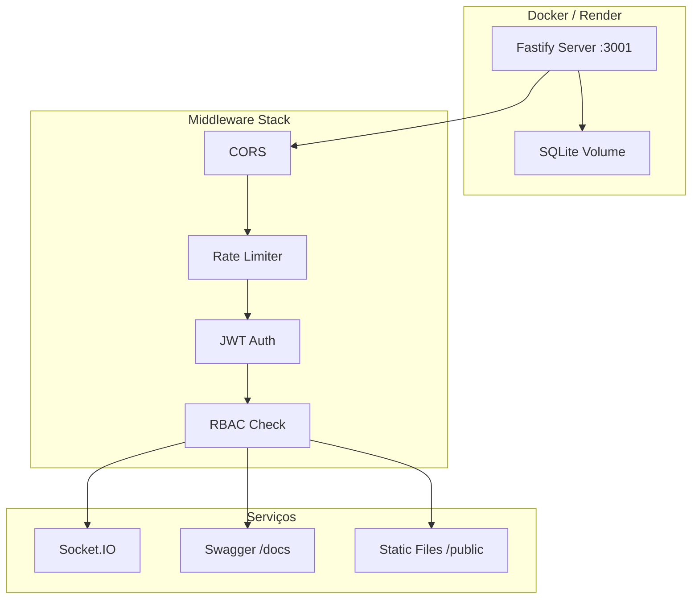
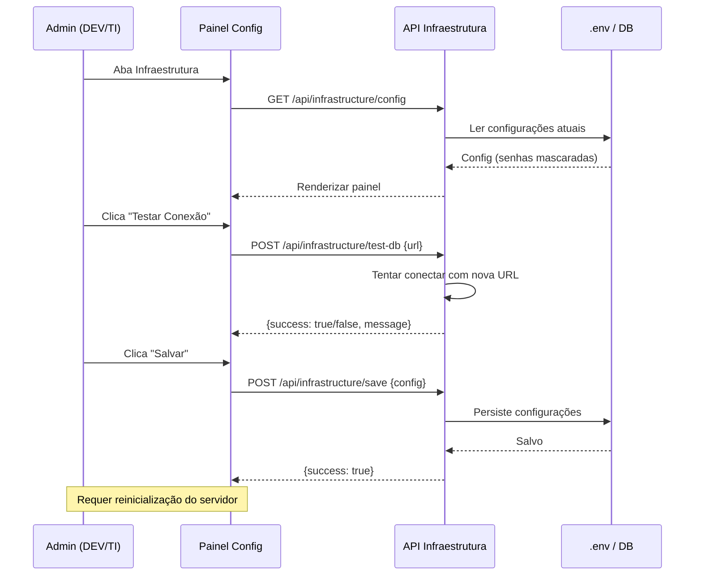

# 📊 Diagramas de Arquitetura e Fluxo — CityMotion

Este documento detalha a estrutura técnica do sistema utilizando diagramas Mermaid.js.

---

## 1. Arquitetura Geral do Sistema

---

## 2. Fluxo de Autenticação e Autorização (JWT)

---

## 3. Diagrama de Entidade-Relacionamento (ERD)

---

## 4. Fluxo de Segurança Completo

---

## 5. Estados do Veículo (Ciclo de Vida)

---

## 6. Fluxo de Notificações em Tempo Real (WebSocket)

---

## 7. Arquitetura de Segurança e Deploy

---

## 8. Fluxo de Configuração de Infraestrutura

